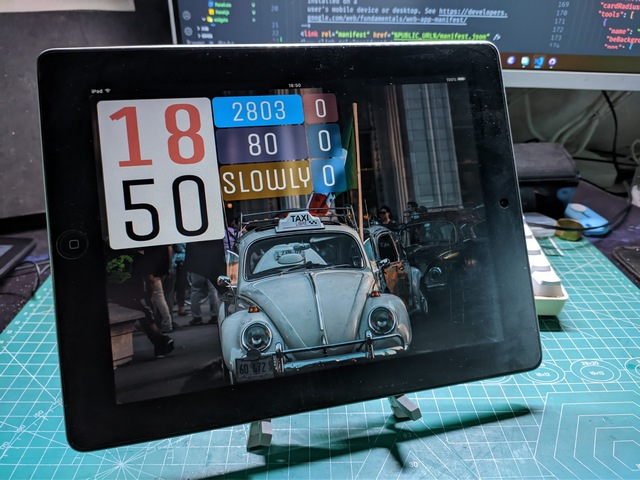
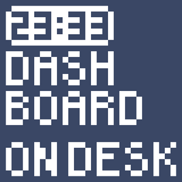

# Dashboard on desk

## TL;DR

桌面上的小组件/小挂件（Widgets）。

此处的桌面有两层含义：

- 用比如平板电脑等设备显示，然后摆放在桌面上。
- 用比如 Wallpaper Engine 之类动态壁纸软件显示，作为电脑桌面（wallpaper）。

小挂件（Widgets）就不需要多做解释了，和手机上的比较相似，但侧重点和灵活度上有所区别。



## 我是老鼠，直接打钱！

啊对对对，这个项目又是付费的，用不用的都随便，钱付了就行了。嗐，虽然可以靠爱发电，但是没有咖啡难以持久啊。

**仅付费用户提供有限技术支持**，其他随缘。




[老鼠爱发电](https://afdian.net/@daomishu)

## TOC

- [Dashboard on desk](#dashboard-on-desk)
  - [TL;DR](#tldr)
  - [我是老鼠，直接打钱！](#我是老鼠直接打钱)
  - [TOC](#toc)
  - [应用场景](#应用场景)
  - [简单吗](#简单吗)
  - [如何安装](#如何安装)
    - [Basic](#basic)
    - [Advanced](#advanced)
    - [Server](#server)
  - [配置](#配置)
    - [服务配置](#服务配置)
    - [组件配置](#组件配置)
  - [工作细节](#工作细节)
    - [面板中的组件：](#面板中的组件)
  - [基础配置](#基础配置)
    - [全局](#全局)
    - [通用](#通用)
    - [图片源](#图片源)
    - [独立组件](#独立组件)
    - [面板设定](#面板设定)
    - [面板组件](#面板组件)
  - [组件列表](#组件列表)
    - [基础功能组件](#基础功能组件)
      - [布局卡片](#布局卡片)
      - [标题](#标题)
      - [导航](#导航)
      - [状态/进度](#状态进度)
      - [最大字号单行文本](#最大字号单行文本)
    - [展示组件](#展示组件)
      - [时间日期类](#时间日期类)
        - [数字时钟](#数字时钟)
        - [纵向数字时钟](#纵向数字时钟)
      - [图片美化类](#图片美化类)
        - [随机图片](#随机图片)
      - [通知数据类](#通知数据类)
        - [简单 JSON 数据展示](#简单-json-数据展示)
        - [Slowly 通知数](#slowly-通知数)
        - [小众论坛（Discourse）未读消息数](#小众论坛discourse未读消息数)
        - [爱发电“投喂”数](#爱发电投喂数)
      - [其他](#其他)
        - [网格信息](#网格信息)

## 应用场景

我有一些旧设备，希望再利用一下，比如 iPad 一代，反应都很迟钝了，除了显示，真的没啥别的用途，但显示效果还是很不错的。

我希望能够及时且方便的获取一些信息，比如看时间，看日期，获知各个网站的未读消息数量等。

我希望电脑壁纸上动态的显示一些有用的东西。

……

所以，我做了这个项目，它很好的满足了我的各种需求。当然，随着小组件的增加，它能完成的远不止上面这些。

## 简单吗

使用起来还是很简单的，但是配置起来很复杂，因为我提供了非常高的自由度，这也就意味着超多的可配置项。而且现在并没有可视化的设置界面，一切都要自己书写 json 文件。

## 如何安装

### Basic

下载项目，用任何你喜欢的方式开启一个 Web 服务器，把项目中的 Public 目录设置为根目录即可。如果你也是用平板电脑之类的设备进行显示，那么打开页面之后可以关闭 Web 服务器。

但这样只能使用其中部分组件。

### Advanced

首先你需要在电脑上安装 [Node.js](https://nodejs.org/) 。

最好也安装 Git，这样后期更新会比较方便。

```bash
# 克隆项目
git clone https://
# 进入项目文件夹
cd Dashboard-on-desk
# 安装必要依赖
npm init
# 启动
npm run start
```

以后使用都只需要最后一条命令启动服务即可。

### Server

第二种方式相比第一种方式多了一个服务，用来解决前端跨域等网络问题。这个服务的功能非常简单，所以你完全可以根据自己的情况自行搭建相应的服务。前后端分离，并完全可配置。

我自己在一台旧电脑上启动这个服务，全天候运行。你也可以在 Nas 等设备上运行。如果喜欢折腾，也可以尝试在手机上运行，Android 手机似乎是可以的，我没有实际测试，如果可行，那么也是一种利用旧设备的途径。

## 配置

按照上面的方式操作都会遭遇报错，因为还没有配置文件。本项目有两个配置文件：

```
/config.json ------ 服务配置
/Public/config.json ------ 组件配置
```

在对应的位置都有 `config.example.json` 文件，可以自行修改名称。具体配置细节在后面会详细解释。

JSON 格式语法十分严格，请务必借助专业编辑器书写，以避免因语法错误带来的烦恼。

### 服务配置

> /config.json

代理网页发出的一些网络请求，实现前端跨域。如果你对这方面完全不了解，可以简单地理解为：网页想要获得其他网站的数据必须通过这个服务中转。

这是一个数组，数组项是每一条代理规则。（详见 `/config.example.json` 文件）。

```js
{
  "path": "/bilibili",
  "target": "http://api.bilibili.com",
  "pathRewrite": {
    "/bilibili": "/"
  },
  "headers": {
    "cookie": "此网站需要设置 cookie 来进行身份认证"
  }
}
```

上面是其中的一条规则，与 [http-proxy-middleware](https://github.com/chimurai/http-proxy-middleware) 的 [Options](https://github.com/chimurai/http-proxy-middleware#options) 完全一致，可自行参照其文档。

或者完全按照示例规则照猫画虎。得到的效果是：

> 访问 http://serverIP:8888/bilibili/x/space/myinfo 的请求会被中转到 http://api.bilibili.com/x/space/myinfo

上面的 `serverIP` 代指运行服务电脑的 ip，请根据具体情况修改。

### 组件配置

> /Public/config.json

```json
{
  "global": {},
  "tools": {},
  "panels": {
    "index": {
      "tools": []
    }
  }
}
```

上面是基本结构，详细设定会在后面逐条列出。

- **global** 全局默认设置，一些基本的、默认的设置。
- **tools** 小组件的默认设置，如果使用独立组件，则会依据这里的设置进行工作
- **panels** 面板，就是小组件的合集，比如我在 iPad 上显示的一套内容就是一个面板，作为电脑壁纸的是另一个面板
  - **index** 这是面板的名称，也会作为面板的路径使用，内部可以放一些面板的设置
  - **tools** 面板中小组件的设定

一个重点：**配置具有多层覆盖特性**。比如独立组件，使用的是 `tools` 合并到（覆盖） `global` 后的结果作为其配置；面板中组件用的是 `tools`（数组中组件对应项）-->`panels`（当前面板的默认配置）-->`tools`（组件默认配置）-->`global`（全局默认配置）这样逐层覆写后的结果作为其配置。

## 工作细节

这里我们必须先解释一下它的工作细节，才能理解后面的具体设定。

我们有很多小工具，在这里我们称之为“小组件”，不过在配置中我用的是 `tools`。

这些小组件可以独立显示，我称之为“独立组件”，比如单独显示时钟组件。

我们也可以把多个组件放在一起显示，我称之为“面板”，即在一个面板上摆放多个组件。

`index` 名称的面板默认（内部没有小组件的话）作为导航面板。任何一个内部没有小组件的面板也会被显示为导航面板。导航面板中会列出所有可用面板，以及 `tools` 中设定的所有组件（作为独立组件）。

### 面板中的组件：

面板中的组件是放在一个称作为“卡片”的容器之中的，注意：**独立组件没有使用容器，也不受卡片设定影响**。组件通过网格进行定位，基本遵循 CSS 中 grid 布局方法。

组件数组中的顺序为组件的层叠顺序，即后面的组件可以遮挡前面的组件。也就是说：面板中的组件不止可以平铺，还可以任意重叠，于是可以用多个组件组合出复杂的效果。

这样有了非常大的灵活度，也使得配置的复杂度变高。不过本工具的设计方向是**日常在桌面上进行展示**，设定好之后很少需要修改，所以初期设定的复杂度高一点可以接受。

同样，因为侧重展示，所以动画和交互方面的功能都会被刻意削弱。

## 基础配置

### 全局

以下设定仅出现在 `global` 中，均为【必须】设定。

- `"interval": 6e5`：配置文件更新间隔，单位：毫秒（ms），`6e5` 是科学计数法，相当于 600000，即 10 分钟。每间隔设定时间，网页会重新读取配置文件，更新设定。在设置时可以写一个比较小的值，比如 `1e4`（10秒），这样对设定的修改可以有一个近似实时的预览。如果设定为 0 则不自动更新，推荐日常设定为 0。
- `"gridSize": 8,`：面板中组件是以网格来进行定位的，这里规定了网格宽度
- `"gap": 4`：网格之间的间距，表现为面板中两个组件之间的间距。调节这两个属性可以变相实现整体缩放，但不推荐后期修改

### 通用

以下设定可以出现在组件的设定中、面板设定中、全局设定中。均为【可选】设定。

- `"cardType": "normal"`：卡片类型，面板中的组件是放在一个称作为“卡片”的容器之中的，通过切换类型可以显示出不同的样式。可选值如下：
  - `normal`（默认）基本卡片样式
  - `noStyle` 无样式
  - `justBorder` 只有边框
  - `borderBlur` 边框+背景模糊
  - `verticalLine` 纵向分割线（仅用于布局，不可关联组件）
  - `horizontalLine` 横向分割线（仅用于布局，不可关联组件）
- `"cardBackground": "rgba(255, 255, 255, .9)"`：卡片背景，此设定会作为卡片的 `background` 属性使用，所以灵活度非常高，颜色，渐变，图片……都可以
- `"cardBlur": 8`：背景模糊程度，如果卡片背景具有透明度，那么底层内容会被模糊，以便内容显示不被影响，默认为 8，一般情况下都是够用的
- `"cardBorder": "1px solid rgba(255, 255, 255, .3)"`：卡片边框设定，会被直接作为 `border` 属性使用
- `"cardRadius": 6,` 卡片圆角

### 图片源

用作随机图片的来源，此设定一般放在 `global` 中，如果使用随机图片组件，则此设定【必须】：

```json
"sources": {
  "unsplash": "https://source.unsplash.com/random/{width}x{height}.{spam}",
  "unsplashProxy": "http://serverIP:8888/unsplash/random/{width}x{height}.{spam}",
  "xjh": "https://img.xjh.me/random_img.php?return=302&type=bg&spam={spam}",
  "ixwgq": "https://api.ixiaowai.cn/gqapi/gqapi.php?spam={spam}"
}
```

其中的属性名作为调用依据，后面的地址中可以包含三个参数：`{width}`、`{height}`、`{spam}`。宽高为组件实际尺寸，`spam` 为一个时间戳，用来避免缓存影响。三个参数均非必须，根据实际情况自行选用。你可以按照规则自行设定随机图片来源，网络中有很多随机壁纸的 API。

unsplash 的随机图片数量大，质量高，非常推荐使用。不过可能遇到访问困难，加载过慢的问题。如果是在平板电脑等设备上显示，又可能不太方便施展魔法。所以可以用本工具的后端服务代理请求（如第二条所示，同时在服务配置中要添加对应的条目）。

### 独立组件

只有在 `tools` 对象中的组件才会被显示在导航列表中。因为一些功能性组件，比如标题，不适合作为独立组件使用。因为是**独立组件，所以没有卡片和位置相关的设定**。

组件的具体设置项会在后面逐个列出，这里只是简单示例一下格式：

```json
"tools": {
  "NumClock": {
    "title": "数字时钟",
    "seconds": false,
    "ink": true
  }
}
```

`NumClock` 是组件的名称（标识），用来说明设定对应的是哪个组件，具体可查阅后面的说明。

`title` 【可选】这是独立组件在导航面板中显示的名称，如果没有此属性，则显示组件的名称（标识），比如这个组件就会被显示为 `NumClock`

### 面板设定

- `title`：作用同上
- `background`：面板背景（同 CSS 的 background 属性）
- `navWidth` 【仅导航面板】导航项的宽度（占据几个网格）
- `navHeight` 【仅导航面板】导航项的高度（占据几个网格）

还可以放入通用中的卡片设定

### 面板组件

```json
"tools": [
  {
    "name": "VerticalClock",
    "beBackground": true,
    "canBeFullscreen": true,
    "linkToSelf": false,
    "linkToUrl": "https:\/\/www.appinn.com\/",
    "pos": {
      "left": "1",
      "top": "1",
      "right": "24",
      "bottom": "32"
    }
  }
]
```

- `name`：【可选】调用的是哪个组件（标识），如未设定则为布局组件，即一个空白的卡片
- `beBackground`：【可选】【唯一】组件被作为面板背景显示，只能有一个组件被设置为背景，多个的话……后面的覆盖前面的，当然也可以利用透明度来实现特殊效果
- `canBeFullscreen`：【可选】组件被点击会全屏显示，再次点击恢复
- `linkToSelf`：【可选】点击后跳转到这个组件的独立组件页面
- `linkToUrl`：【可选】链接到某个网址，因为 json 格式关系，个别符号需要转义
- `pos`：【必须】组件位置，上下左右，起始坐标均为 1。这里有一些注意事项：
  - 即便是组件被设定为背景，这个属性依然需要，不过数值可以写的随意一点
  - `right` 和 `bottom` 可以换成 `width`、`height`，当然表达的含义是组件的宽高
  - `right` 和 `bottom` 可以省略，如果同时也没有宽高设定，则延申到最右侧和最底部
  - 多个组件位置可以重叠，借此可以做出一些有趣的效果
  - 下一个组件的 `top` 等于上一个组件的 `bottom`，这样两个组件紧邻，并且中间间隔设定的宽度（`gap`），左右同理。

注意：`beBackground`、`canBeFullscreen`、`linkToSelf`、`linkToUrl` 四个属性互斥，优先级从高到低。默认值均为：`false`

## 组件列表

### 基础功能组件

只作为面板中布局使用，不适合（或不可以）作为独立组件使用

#### 布局卡片

不调用任何组件，只显示一个卡片，通过调整卡片配置获得各种效果，比如划定一个范围等。

- **标识（name）**：无。这样

#### 标题

显示一个标题

- **标识（name）**：`Title`
- **align**：对齐方式，或者说文字定位。默认为 `flex-pos-4`，即文字靠左，垂直居中。最后的数字可以视为九宫格中的位置（参见下方九宫格）
- **content**：显示的内容（文字）

**附：九宫格**

|  | 左 | 中 | 右 |
|---|---|---|---|
| 上 | flex-box-1 | flex-box-2 | flex-box-3 |
| 中 | flex-box-4 | flex-box-5 | flex-box-6 |
| 下 | flex-box-7 | flex-box-8 | flex-box-9 |

#### 导航

导航（链接），用来链接到某个面板或者独立组件，主要供内部调用，后面会有专门的链接组件，所以此组件不推荐使用。

- **标识（name）**：`Nav`
- **align**：`left|center|right` 文字对齐方向
- **path**：链接路径，一般为组件/面板标识
- **title**：显示文字

#### 状态/进度

**内部组件，不可独立使用**。用来标记某个组件的当前状态，或显示其进度。默认以卡片背景形式（卡片底层覆盖，不影响原本卡片背景）呈现，可以设置为圆点或者角标形式。进度可以转换为状态显示，或者以进度条形式显示。

#### 最大字号单行文本

**内部组件，不可独立使用**。根据组件实际尺寸，以最大字号来显示当前文本。

### 展示组件

这部分是主要组件，用作独立组件或者在面板中组合，每一个组件拿出来都是一个独立的功能。

#### 时间日期类

##### 数字时钟

横向数字时钟

- **标识（name）**：`NumClock`
- **second**：是否显示秒钟，默认 `false`
- **ink**：是否墨水屏效果（目前只是文字阴影），默认 `false`

##### 纵向数字时钟

- **标识（name）**：`VerticalClock`
- **ink**：是否墨水屏效果（目前只是文字阴影），默认 `false`
- **hourColor**：小时文字颜色
- **hourWeight**：小时文字字重（受字体限制仅能呈现两个效果）
- **minuColor**：分钟文字颜色
- **minuWeight**：分钟文字字重（受字体限制仅能呈现两个效果）

#### 图片美化类

##### 随机图片

从指定图源获取随机图片，可以搭配 `beBackground` 属性作为面板背景，或者位置与其他组件重叠，作为背景使用。

- **标识（name）**：`RandomPic`
- **type**：图片来源，图片源（sources）中对应的名称
- **interval**: 更新频率，单位毫秒（ms），设置为 0 则不自动更新

#### 通知数据类

##### 简单 JSON 数据展示

简单的 JSON API 数据读取展示。用以获取其中某个指定数据并展示出来。比如粉丝数等。可以搭配 `cardBackground` 属性等，为不同数据设定不同的展示样式。

数据获取涉及跨域，所以需要后台服务中转，参见上面服务配置。如需身份验证，cookie 也在服务配置中进行设置。

- **标识（name）**：`EasyJson`
- **interval**: 更新频率，单位毫秒（ms），设置为 0 则不自动更新
- **href**：API 地址，注意：返回的数据格式必须是 JSON
- **path**：要显示的数据在 JSON 中的路径
- **color**：文字颜色
- **onTrue**：当数据为真时添加 `true` 状态，用以突出显示不为 0 的消息数，默认为 `false`
- **trueBackground**：当数据为真时的背景，需先开启上一项


##### Slowly 通知数

[Slowly](https://slowly.app/) 寄送中的邮件数量和未读邮件数量。两个数值，前一个是寄送中，后一个是已寄达但尚未阅读的数量。如果两者都为 0，则显示 `SLOWLY`。如果 `token` 失效，两者都显示 401。

- **标识（name）**：`SlowlyNotic`
- **interval**: 更新频率，单位毫秒（ms），设置为 0 则不自动更新
- **incomingHref**：寄送中 API 地址（`https://api.getslowly.com/letter/incoming/check?token=`），涉及跨域，需后台服务支持
- **unreadingHref**：未读邮件 API 地址（`hhttps://api.getslowly.com/letter/incoming/check?token=`），涉及跨域，需后台服务支持
- **token**：身份识别，打开开发者工具，在网络请求里获取，获取一次能用十天半个月的，不算很烦人。
- **color**：文字颜色
- **trueBackground**：有新邮件时的背景颜色

##### 小众论坛（Discourse）未读消息数

Discourse 论坛的未读消息数，各种设置同 EasyJson。不过内部对数据做了一点细节处理。API 地址为：`https://论坛地址/notifications.json`。同样的，涉及跨域和身份验证（cookie），需后台服务支持

- **标识（name）**：`MetaNotic`

##### 爱发电“投喂”数

基本设置同 EasyJson，详细 API 查看爱发电——作者——开发者页面。使用不同的 `path` 设定可以读取不同的数据，不过目前只支持单一数据的展示。

- **标识（name）**：`AfdianNotic`
- **user_id**：在开发者页面中获取
- **token**：在开发者页面中获取

#### 其他

##### 网格信息

输出当前屏幕网格数量，辅助布局规划，后期会增加更多信息。

- **标识（name）**：`GridInfo`

